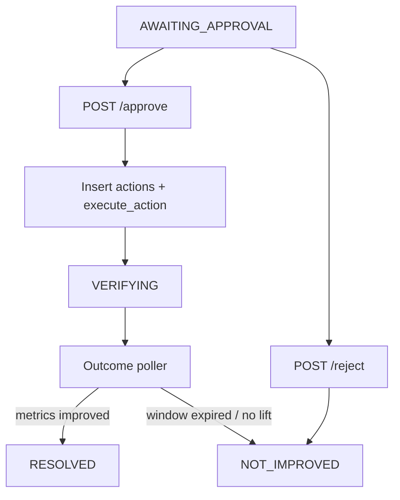

# LOSSLine — Progress & Phase Plans

Team: The Operators · Hackverse 2.0  
Stack: **Express + TypeScript · Neon Postgres · Redis Streams · Gemini** (not Fastify / not Anthropic)

Source of truth for product scope: [lossline-prd.md](./lossline-prd.md)

---

## Status overview

| Phase | Focus | Status |
|---|---|---|
| **0 — Foundation** | Express skeleton, Neon schema, Redis helpers, `LLMClient` + Gemini | **Done** |
| **1 — Ingestion + Detection** | `/api/events`, rolling metrics, thresholds, `DETECTED` incidents | **Done** |
| **2 — Agent Loop + Tools** | 7 tools, Gemini investigation, `agent_runs`, confidence, recommendation | **Done** |
| **3 — Approval + Action + Outcome** | approve/reject, execute, outcome poller | **Done** |
| **4 — Frontend wiring** | Simple HTML dashboard + agent-loop page | **In progress** |
| **5 — Demo polish** | scripted run-through, fallback recording | Not started |

---

## What we’ve done

### Phase 0 — Backend foundation

**Location:** [`backend/`](./backend/)

- Express + TypeScript app (`src/app.ts`, `src/index.ts`) with `GET /health`
- Zod-validated env (`src/config/env.ts`)
- Neon Postgres pool with TLS (`src/db/pool.ts`)
- Full PRD schema migrated: `events`, `incidents`, `agent_runs`, `recommendations`, `actions`, `outcomes`, `rolling_metrics` (`src/db/schema.sql`, `npm run db:migrate`)
- Redis Streams helpers with soft-fail if Redis is down (`src/redis/`)
- Provider-agnostic `LLMClient` + Gemini implementation (`src/llm/`) — unused until Phase 2
- Domain types for statuses, event types, metrics (`src/types/`)

### Phase 1 — Ingestion + detection

- `POST /api/events` — single or batch ingest → Neon (+ Redis XADD when available)
- `GET /api/incidents`, `GET /api/incidents/:id`
- Rolling metrics (15m / 60m): order velocity, prep time, cancellation rate, handoff delay
- Deterministic detection loop (`src/loops/detection.ts`) every `DETECTION_INTERVAL_MS`
  - Redis consumer group **or** Postgres `id > last_seen` fallback
  - Thresholds from env; overload = ≥2 signals
  - Dedup: no second open incident per store while one is in `DETECTED`…`VERIFYING`
- Worker process: `npm run dev:worker`
- Demo scripts:
  - `npm run replay:overload` — seed burst + detect
  - `npm run replay:fresh` — resolve open + wipe store data + detect again
  - `npm run replay:reset` / `replay:reset:wipe`

**Verified:** overload replay creates a real `DETECTED` incident on Neon with baseline reasons (velocity spike, prep, cancels, handoff).

### Phase 2 — Agent loop + tools (done)

- All 7 tools under `src/tools/` with zod inputs; math stays in code
- Deterministic confidence via `get_related_signals` (`services/confidence.ts`)
- Gemini investigation loop (`loops/investigation.ts`, `MAX_STEPS` from env)
- `agent_runs` persistence per step; `recommendations` row on finish
- Worker runs detection **and** investigation (`claimNextDetectedIncident`)
- `GET /api/incidents/:id` returns agent runs + recommendation
- `POST /api/incidents/:id/investigate` for manual kick
- Smoke: `npm run smoke:investigate` → `AWAITING_APPROVAL` with formula confidence
- Default model: `gemini-2.5-flash` (2.0-flash retired)

**Verified E2E:** DETECTED → 3 agent steps with tools → recommendation (`pause_delivery`, confidence 85%) → `AWAITING_APPROVAL`.

### Phase 3 — Approval + action + outcome (done)

- `POST /api/incidents/:id/approve` — create `actions` row → simulated `execute_action` → `VERIFYING`
- `POST /api/incidents/:id/reject` — log rejection on `actions` → `NOT_IMPROVED`
- Simulated execute injects post-action recovery events (healthy prep/handoff, cooled order flow)
- Outcome poller in worker (`loops/outcome.ts`) every `OUTCOME_POLL_INTERVAL_MS`
  - Compares incident baseline `metrics_15m` vs post-`executed_at` metrics
  - Writes `outcomes` + sets `RESOLVED` / `NOT_IMPROVED`
- `POST /api/incidents/:id/evaluate-outcome` — force evaluation (smoke/debug)
- `GET /api/incidents/:id` includes `action` + `outcome`
- Smoke: `npm run smoke:approve` (full path) or `--reuse` for existing `AWAITING_APPROVAL`

### Phase 4 — Frontend (executive dashboard)

**Location:** [`frontend/`](./frontend/) — served by Express at `http://localhost:3001/`

- `index.html` — Executive dashboard: KPIs, Chart.js activity timeline, active alerts, Leaflet outlet map + branch cards, incident feed, Copilot drawer
- `agent.html` — status pipeline + decision graph (agent_runs tools → recommendation → action → outcome)
- APIs: `GET /api/summary`, `GET /api/metrics`, `GET /api/activity`, `GET /api/branches`, `POST /api/copilot`

### Explicitly not done yet

- WebSocket / SSE live push (UI polls every 4–5s for now)
- Full multi-store ingestion (portfolio companions are demo + live primary store)
- CSV upload UI

---

## Phase 3 — Implementation plan (completed)

**Goal:** Human can approve or reject a recommendation; approve runs simulated `execute_action`, then the outcome poller verifies metric recovery and closes the incident.

### Flow



### Done when

- [x] Approve moves `AWAITING_APPROVAL` → `APPROVED` → `EXECUTING` → `VERIFYING`
- [x] Reject closes with logged rejection → `NOT_IMPROVED`
- [x] `actions` row with `approved_at` / `executed_at`
- [x] Outcome poller writes `outcomes` and terminal status
- [x] Smoke path without hanging the worker

---

## How to run what’s built today

```bash
cd backend
npm install
npm run db:migrate
npm run dev          # API :3001
npm run dev:worker   # detection + investigation + outcome

npm run replay:fresh       # clean demo → DETECTED
npm run smoke:investigate  # DETECTED → Gemini → AWAITING_APPROVAL
npm run smoke:approve      # … → approve → VERIFYING → RESOLVED/NOT_IMPROVED
# then: GET http://localhost:3001/api/incidents/:id
```

Requires `GEMINI_API_KEY` and `GEMINI_MODEL=gemini-2.5-flash` in `backend/.env` for investigation steps.
