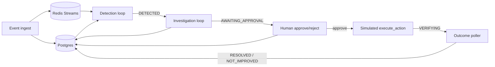

# LOSSLine

**Correlates fragmented restaurant ops data to explain why a location is bleeding money right now — and recommends a specific fix, not another dashboard.**

Multi-location kitchens (demo brand: **Meghana Biryani**) have POS, delivery, staffing, inventory, and review data sitting in silos. Managers see symptoms — cancellations up, reviews dropping — but not root cause. LOSSLine closes that gap with a closed loop:

1. **Detect** — deterministic thresholds on rolling metrics (no LLM)
2. **Investigate** — Gemini agent with native tool calls over real Postgres data
3. **Approve** — human pause point before any action
4. **Verify** — outcome poller checks whether metrics actually recovered

No LangChain, no vector DB, no agent framework. Agent “memory” is Postgres rows (`agent_runs`) plus a plain `for` loop.

**Team:** The Operators (Rakshith, Raghuttama, Chandranshu, Gaurav) · Hackverse 2.0, MIT Bengaluru

---

## Table of contents

- [Product overview](#product-overview)
- [Architecture](#architecture)
- [Tech stack](#tech-stack)
- [Repo layout](#repo-layout)
- [Data model](#data-model)
- [The three worker loops](#the-three-worker-loops)
- [Investigation tools](#investigation-tools)
- [Incident lifecycle](#incident-lifecycle)
- [API reference](#api-reference)
- [Frontend](#frontend)
- [Meghana scenarios (G1–G6)](#meghana-scenarios-g1g6)
- [Portfolio & location analytics](#portfolio--location-analytics)
- [Quick start](#quick-start)
- [Environment variables](#environment-variables)
- [Scripts](#scripts)
- [Design principles](#design-principles)
- [Project status](#project-status)
- [Further reading](#further-reading)

---

## Product overview

| | |
|---|---|
| **Problem** | Ops teams react late because signals are fragmented across POS, aggregators, kitchen, and reviews. |
| **In scope (MVP)** | Detect → investigate → approve → verify for operational overload; Meghana gold scenarios; multi-outlet portfolio UI. |
| **Out of scope** | LangChain / LangGraph, vector DBs, Kafka, microservices, inventing actions outside a canned catalog. |

**Demo narrative:** Koramangala is the live kitchen (`STORE_ID`). Companion outlets (Jayanagar, Indiranagar, …) power map + location analytics. Gold scenarios G1–G6 prove the agent can tell *stockout* from *capacity*, *staffing*, and *delivery oversell*.

---

## Architecture

Two Node processes share one Postgres state machine. Redis Streams is an optional event handoff; if Redis is down, detection polls Postgres by cursor.

```
Scenario replay / POST /api/events / seed:portfolio
            │
            ▼
     Express API (:3001)
     ├── REST routes
     └── Static frontend/
            │
      ┌─────┴─────┐
      ▼           ▼
 Neon Postgres   Redis Stream (optional)
 (source of      XADD on ingest
  truth)              │
      ▲               ▼
      │        Worker process
      │        ├── Detection loop   (every ~5s, no LLM)
      │        ├── Investigation    (Gemini + tools)
      │        └── Outcome poller   (every ~10s)
      └────────────┘
```



**Why this shape:** deterministic code owns triggers and math (thresholds, confidence, ₹/hr exposure). The LLM owns synthesis and explanation. The only “framework” is Postgres rows + loops.

---

## Tech stack

| Layer | Choice | Notes |
|---|---|---|
| **API** | Express · TypeScript · Node 20+ | ESM (`"type": "module"`), Zod-validated env |
| **Worker** | Same codebase (`src/worker.ts`) | Detection + investigation + outcome in parallel |
| **DB** | Neon Postgres (`pg`) | Durable truth for events, incidents, agent state |
| **Event handoff** | Redis Streams (`ioredis`) | Soft-fail → Postgres `id > last_seen` poll |
| **LLM** | Gemini via `@google/generative-ai` | Default `gemini-2.5-flash`; provider-agnostic `LLMClient` |
| **Frontend** | Vanilla HTML / CSS / JS | Served by Express from `frontend/`; Chart.js + Leaflet CDN |
| **Validation** | Zod | Env + tool inputs |
| **Realtime** | UI polling (~4–5s) | WebSocket/SSE planned, not required for demo |

### Key npm dependencies

- **Runtime:** `express`, `cors`, `pg`, `ioredis`, `@google/generative-ai`, `zod`, `uuid`, `ws`, `dotenv`
- **Dev:** `tsx`, `typescript`, `@types/*`

---

## Repo layout

```
final-lossline/
├── README.md                 # This file
├── lossline-prd.md           # Original product & technical spec
├── PROGRESS.md               # Phase status & runbook notes
├── frontend/                 # Static UI (served by Express)
│   ├── index.html            # Executive dashboard
│   ├── agent.html            # Root-cause / agent trace
│   ├── location.html         # Per-outlet analytics + compare
│   ├── scenarios.html        # Meghana G1–G6 runner
│   ├── css/app.css
│   └── js/                   # dashboard, agent, location, scenarios, api
└── backend/
    ├── package.json
    ├── .env.example
    ├── scripts/              # replay, smoke, seed
    └── src/
        ├── index.ts          # HTTP entry
        ├── worker.ts         # Three loops
        ├── app.ts            # Express app + static frontend
        ├── config/env.ts
        ├── db/               # pool, schema.sql, migrate
        ├── redis/            # client + streams helpers
        ├── llm/              # Gemini + LLMClient types
        ├── routes/           # health, events, incidents, summary, …
        ├── services/         # metrics, detection, approval, outcomes, …
        ├── loops/            # detection, investigation, outcome
        ├── tools/            # Investigation tool defs + implementations
        ├── prompts/          # Investigation prompt
        ├── scenarios/        # Meghana G1–G6 event builders
        ├── portfolio/        # Store catalog + seed profiles
        └── types/
```

---

## Data model

Postgres schema (`backend/src/db/schema.sql`):

| Table | Role |
|---|---|
| `events` | Raw ops events (`type` + `payload` JSONB) |
| `rolling_metrics` | 15m / 60m aggregates per store + metric |
| `incidents` | Status machine + baseline snapshot at detect time |
| `agent_runs` | Append-only LLM message log per step (**this is agent memory**) |
| `recommendations` | Confidence, explanation, `action_type`, ₹ exposure |
| `actions` | Approve/reject audit + execute timestamps |
| `outcomes` | Before/after metrics + `RESOLVED` / `NOT_IMPROVED` |

### Event types

`order` · `prep_complete` · `handoff` · `cancellation` · `review` · `inventory_snapshot` · `staffing_snapshot` · `replenishment` · `delivery_accept`

### Metrics (rolling)

`order_velocity` · `prep_time` · `cancellation_rate` · `handoff_delay`

### Incident type (MVP)

`operational_overload`

---

## The three worker loops

Run with `npm run dev:worker` (separate process from the API).

### 1. Detection — deterministic, no LLM

- Interval: `DETECTION_INTERVAL_MS` (default 5s)
- Hints from Redis consumer group **or** Postgres cursor
- Updates rolling metrics, evaluates thresholds from env
- Overload when enough signals fire (e.g. velocity spike, prep, cancels, handoff)
- Dedup: no second open incident while one is already in flight for the store
- Creates incident with status `DETECTED` and a baseline snapshot

### 2. Investigation — Gemini native tool calling

- Claims next `DETECTED` incident → `INVESTIGATING`
- Up to `AGENT_MAX_STEPS` (default 6) tool-calling rounds
- Persists each step to `agent_runs`
- Math stays in tools; model reasons over tool results only
- Writes `recommendations` and moves to `AWAITING_APPROVAL`
- Safety: if steps exhaust without converging → manual-review path (does not hang the UI)

### 3. Outcome — verify the fix worked

- Interval: `OUTCOME_POLL_INTERVAL_MS` (default 10s)
- Window: `OUTCOME_WINDOW_MS` (default 2 min)
- After approve → simulated `execute_action` injects recovery events → `VERIFYING`
- Compares post-action metrics vs incident baseline → `RESOLVED` or `NOT_IMPROVED`

---

## Investigation tools

All calculations live in TypeScript. The LLM never invents confidence %, ₹ exposure, or new action types.

| Tool | Returns |
|---|---|
| `get_metrics` | Time-window metric for a store |
| `get_recent_events` | Raw recent events |
| `get_baseline` | Longer-window normal range |
| `get_related_signals` | Correlated signals + **deterministic confidence %** |
| `get_kitchen_state` | Inventory / staffing / replenishment / delivery oversell + inferred root cause |
| `get_incident_history` | Past incidents + what was recommended |
| `calculate_revenue_exposure` | Estimated ₹/hr loss (formula) |
| `get_recommendation_options` | Canned actions only — model must pick one |

### Canned actions

`pause_delivery` · `call_in_prep_staff` · `extend_prep_eta` · `throttle_new_orders` · `emergency_stock_transfer` · `eighty_six_sku`

### Confidence score

Weighted confirmed/checked signals (`services/confidence.ts`) — not LLM prose. Signal set includes velocity, prep, handoff, cancels, reviews, inventory shortage, staffing shortfall, delivery oversell.

---

## Incident lifecycle

```
DETECTED → INVESTIGATING → AWAITING_APPROVAL
                              ├─ approve → APPROVED → EXECUTING → VERIFYING → RESOLVED
                              │                                              ↘ NOT_IMPROVED
                              └─ reject  → NOT_IMPROVED
```

Human approval is a real pause: state is persisted; resume is `POST /api/incidents/:id/approve`.

---

## API reference

Base URL: `http://localhost:3001`

| Method | Path | Purpose |
|---|---|---|
| `GET` | `/health` | Liveness + DB/Redis status |
| `POST` | `/api/events` | Ingest single event or `{ events: [...] }` |
| `GET` | `/api/incidents` | Incident feed |
| `GET` | `/api/incidents/:id` | Detail + agent runs + recommendation + action + outcome |
| `POST` | `/api/incidents/:id/investigate` | Manually kick investigation |
| `POST` | `/api/incidents/:id/approve` | Approve recommendation (`approvedBy` optional) |
| `POST` | `/api/incidents/:id/reject` | Reject (`reason` optional) |
| `POST` | `/api/incidents/:id/evaluate-outcome` | Force outcome evaluation (smoke/debug) |
| `GET` | `/api/summary` | Dashboard KPIs |
| `GET` | `/api/metrics` | Rolling metrics |
| `GET` | `/api/activity` | Activity timeline series |
| `GET` | `/api/branches` | Portfolio branch cards / risk |
| `POST` | `/api/copilot` | Natural-language ops Q&A over live context |
| `GET` | `/api/locations` | Portfolio outlet list |
| `GET` | `/api/locations/:storeId` | Per-outlet analytics |
| `GET` | `/api/locations/compare` | Compare outlets (e.g. Jayanagar vs Koramangala) |
| `POST` | `/api/locations/seed` | Seed location history |
| `GET` | `/api/scenarios` | Meghana scenario catalog |
| `GET` | `/api/scenarios/kitchen` | Kitchen-state snapshot |
| `POST` | `/api/scenarios/run` | Run a gold scenario (e.g. G3) |

Static UI is served from the same origin (`/`, `/agent.html`, `/location.html`, `/scenarios.html`).

---

## Frontend

Vanilla SPA-style pages (no Next.js build step). Styled with DM Sans / JetBrains Mono; charts via Chart.js; map via Leaflet.

| Page | URL | What it shows |
|---|---|---|
| **Dashboard** | `/` · `index.html` | KPIs, activity chart, Leaflet outlet map, alerts, incident feed, Copilot drawer |
| **Root Cause** | `/agent.html` | Status pipeline + investigation graph (tools → recommendation → action → outcome) |
| **Locations** | `/location.html` | Per-outlet POS / reviews / inventory deep dive + compare |
| **Scenarios** | `/scenarios.html` | Run Meghana G1–G6 demos |

UI polls the API periodically for live feel (WebSocket/SSE not required for the hackathon demo).

---

## Meghana scenarios (G1–G6)

Scripted event streams that prove root-cause discrimination (not just “something’s wrong”).

| ID | Name | Proves |
|---|---|---|
| **G1** | Normal lunch | No false positive / no cry wolf |
| **G2** | Demand spike, stock OK | Capacity pressure (inventory healthy) |
| **G3** | Stockout | Inventory shortage on hero SKU |
| **G4** | Mid-window replenishment | Usable supply returns after transfer |
| **G5** | Staffing shortfall | People missing, not rice |
| **G6** | Delivery oversell | Aggregator past slot cap ≠ kitchen shortage |

```bash
# CLI
npm run replay:meghana -- G3

# or API / scenarios.html
POST /api/scenarios/run  { "scenarioId": "G3" }
```

---

## Portfolio & location analytics

Defined in `backend/src/portfolio/stores.ts`:

| Outlet | Seeded analytics | Role |
|---|---|---|
| Koramangala (`STORE_ID`) | Yes | Live kitchen for detection/agent |
| Jayanagar | Yes | Compare / location deep dive |
| Indiranagar | Yes | Higher-risk companion |
| Airport, HSR Hub, Whitefield | Map companions | Demo cards until seeded |

```bash
npm run seed:portfolio                 # 7-day history for seeded outlets
npm run seed:portfolio:keep-primary    # keep primary store events
```

---

## Quick start

### Prerequisites

- Node.js **20+**
- Neon (or any Postgres) connection string
- Gemini API key (for investigation + copilot)
- Redis optional

### Setup

```bash
cd backend
cp .env.example .env
# set DATABASE_URL (Neon pooled URL + ?sslmode=require)
# set GEMINI_API_KEY

npm install
npm run db:migrate
npm run seed:portfolio   # optional but recommended for location UI
```

### Run (two terminals)

```bash
# Terminal A — API + UI
npm run dev

# Terminal B — detection + investigation + outcome
npm run dev:worker
```

Then open:

- Dashboard: http://localhost:3001/
- Locations: http://localhost:3001/location.html
- Agent: http://localhost:3001/agent.html
- Scenarios: http://localhost:3001/scenarios.html
- Health: http://localhost:3001/health

### End-to-end smoke

```bash
npm run replay:fresh        # overload → DETECTED
npm run smoke:investigate   # → Gemini → AWAITING_APPROVAL
npm run smoke:approve       # → VERIFYING → RESOLVED / NOT_IMPROVED
# optional: npm run smoke:approve -- --reuse
```

---

## Environment variables

Copy from [`backend/.env.example`](./backend/.env.example).

| Variable | Required | Default | Purpose |
|---|---|---|---|
| `DATABASE_URL` | Yes | — | Neon/Postgres URL |
| `PORT` | No | `3001` | API port |
| `STORE_ID` | No | `store_demo_01` | Primary live kitchen |
| `GEMINI_API_KEY` | For agent/copilot | — | Investigation + copilot |
| `GEMINI_MODEL` | No | `gemini-2.5-flash` | Model id |
| `REDIS_URL` | No | `redis://127.0.0.1:6379` | Soft-fail if down |
| `REDIS_STREAM_KEY` | No | `lossline:events` | Stream name |
| `REDIS_CONSUMER_GROUP` | No | `lossline-detectors` | Consumer group |
| `REDIS_CONSUMER_NAME` | No | `detector-1` | Consumer name |
| `THRESHOLD_ORDER_VELOCITY_SPIKE` | No | `1.8` | × baseline |
| `THRESHOLD_PREP_TIME_MINUTES` | No | `18` | Prep SLA |
| `THRESHOLD_CANCEL_RATE` | No | `0.12` | Cancel fraction |
| `THRESHOLD_HANDOFF_DELAY_MINUTES` | No | `8` | Handoff SLA |
| `DETECTION_INTERVAL_MS` | No | `5000` | Detection tick |
| `OUTCOME_POLL_INTERVAL_MS` | No | `10000` | Outcome tick |
| `OUTCOME_WINDOW_MS` | No | `120000` | Verify window |
| `AGENT_MAX_STEPS` | No | `6` | Max tool rounds |

---

## Scripts

From `backend/`:

| Script | Purpose |
|---|---|
| `npm run dev` | API + static UI (hot reload via `tsx watch`) |
| `npm run dev:worker` | Detection + investigation + outcome |
| `npm run build` | Compile to `dist/` + copy schema |
| `npm run start` / `start:worker` | Run compiled JS |
| `npm run db:migrate` | Apply `schema.sql` |
| `npm run typecheck` | `tsc --noEmit` |
| `npm run replay:overload` | Seed overload burst + detect once |
| `npm run replay:fresh` | Resolve open, wipe store data, detect |
| `npm run replay:reset` | Resolve open incidents |
| `npm run replay:reset:wipe` | Resolve + delete store events/metrics |
| `npm run replay:meghana` | Run Meghana scenario (`-- G3`) |
| `npm run smoke:investigate` | Fresh overload + Gemini E2E |
| `npm run smoke:approve` | Approve + outcome E2E (`--reuse` ok) |
| `npm run seed:portfolio` | Seed multi-outlet history |

More API examples: [`backend/README.md`](./backend/README.md)

---

## Design principles

1. **Deterministic owns the numbers** — detection thresholds, confidence %, revenue exposure.
2. **LLM owns the narrative** — root-cause explanation and which canned action to pick.
3. **No agent framework** — `agent_runs.messages` is memory; approve/resume is reload + continue.
4. **Human in the loop** — no auto-execute; managers approve before simulated remediation.
5. **Verify or it didn’t happen** — outcome poller closes the loop with before/after metrics.
6. **Redis is optional** — Postgres alone is enough for a single-store demo.

---

## Project status

| Phase | Focus | Status |
|---|---|---|
| 0 — Foundation | Express, Neon schema, Redis, Gemini client | **Done** |
| 1 — Ingestion + Detection | Events, rolling metrics, `DETECTED` | **Done** |
| 2 — Agent + Tools | Tools, investigation → `AWAITING_APPROVAL` | **Done** |
| 3 — Approval + Outcome | Approve/reject, execute, verify | **Done** |
| 4 — Frontend | Dashboard, agent, locations, scenarios, copilot | **Done / polishing** |
| 5 — Demo polish | Scripted run-through, fallback recording | In progress |

### Known gaps (intentional for MVP)

- WebSocket / SSE live push (UI polls today)
- Full multi-store live ingestion (portfolio companions partially seeded)
- CSV upload UI

---

## Further reading

- [PROGRESS.md](./PROGRESS.md) — detailed phase notes and verified smoke paths
- [lossline-prd.md](./lossline-prd.md) — original PRD (some stack names evolved: Express not Fastify, Gemini not Anthropic, HTML UI not Next.js)
- [backend/README.md](./backend/README.md) — backend-focused runbook and curl examples
